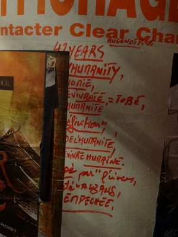

hugonot
=======

This is a data repository about Strasbourg-based artist Hugonot P. and his ongoing streetart masterpiece.

# Artwork
Hugonot's work is mainly made of inscriptions on advertising columns in the Krutenau area, in Strasbourg. Inscriptions can be short or long, in any color and usually don't make a lot of sense by themselves. They are eventually covered by new ads and posters, and disappear.
It is not known when Hugonot started this performance/artwork, but it has probably been going on for more than a decade as of 2014. The ephemeral nature of his work makes it difficult to track and document.

# Contribute !
If you are wandering in Strasbourg, in the Krutenau area, you might come across Hugonot's work. Take a look at those concrete columns known as "colonnes Morris", between concert banners and party posters.
If you spot something, please take a picture and send it to me trackinghugonot@gmail.com (including date and GPS coordinates would be awesome !).

# Reading clues
## Planet of the Apes
Hugonot's work is inspired by [La Planète des Singes](http://en.wikipedia.org/wiki/Planet_of_the_Apes_(novel)), a book written by french author Pierre Boulle in 1963. The character Dr. Zaïus is mentioned regularly as the Simian leader.
## Durations, dates and ages
The most recurrent item in the inscriptions is probably "43 years/day". This mention hasn't changed over the years.
Another item is "20 years"
## Hearts
Whenever a heart appears in the writings, it is to be read as the word "vivant" (living) such as in "être ♥", "être vivant". This clue has been given by Hugonot himself.
## Christianity
Some references to Jesus-Christ (mostly for dates) and to God are also to be found.
## Names ###
Apart from his signature ("HUGONOT P.") and the name of Zaïus, the artist also writes "REMETTER CHRISTINE" regularly.
